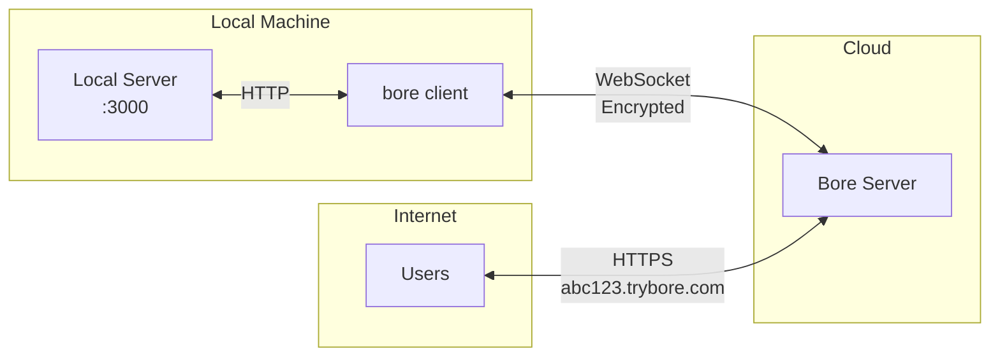

<p align="center">
  
</p>

<h1 align="center">Bore</h1>

<p align="center">
  <strong>A blazing fast, free & open source TCP tunnel that exposes your localhost to the world.</strong>
</p>

<p align="center">
  <a href="https://github.com/Aditya-ds-1806/bore/blob/main/LICENSE">
    
  </a>
  <a href="https://github.com/Aditya-ds-1806/bore/releases">
    
  </a>
  <a href="https://github.com/Aditya-ds-1806/bore/stargazers">
    
  </a>
</p>

<p align="center">
  <a href="#features">Features</a> •
  <a href="#installation">Installation</a> •
  <a href="#usage">Usage</a> •
  <a href="#self-hosting">Self-Hosting</a> •
  <a href="#license">License</a>
</p>

---

## Features

- ⚡ **Blazing Fast** — Written in Go for maximum performance with sub-millisecond overhead
- 🔒 **Encrypted** — All traffic is encrypted end-to-end
- 🎯 **Zero Config** — One command to start tunneling, no signup required
- 🔍 **Request Inspector** — Built-in web UI to inspect, replay, and debug HTTP requests
- 💻 **Terminal UI** — Beautiful TUI with live logs and powerful filtering
- 🌐 **Self-Hostable** — Run your own bore server with zero vendor lock-in
- ⭐ **100% Open Source** — MIT licensed, free forever

## Installation

### Using Go

```bash
go install github.com/Aditya-ds-1806/bore/cmd/bore@latest
```

### From Source

```bash
git clone https://github.com/Aditya-ds-1806/bore.git
cd bore
make build-client
```

The binary will be available at `./build/bore`.

### Prebuilt binaries

If you prefer not to build from source, prebuilt binaries are available on the Releases page:

[https://github.com/Aditya-ds-1806/bore/releases](https://github.com/Aditya-ds-1806/bore/releases)

Binaries are provided for major platforms — download the appropriate release for your OS and architecture.

## Usage

Expose your local server to the internet with a single command:

```bash
bore -u http://localhost:3000
```

That's it! You'll receive a public URL like `https://abc123.trybore.com` that tunnels to your local server.

### Options

| Flag | Description |
|------|-------------|
| `-u`, `--url` | Upstream URL to proxy requests to (required) |
| `-v`, `--version` | Show application version |

### Web Inspector

When you start a tunnel, a web inspector runs at `http://localhost:8000`. Use it to:

- View all incoming requests in real-time
- Inspect request/response headers and bodies
- Replay requests for debugging

## Self-Hosting

Bore is **100% free** and fully self-hostable. Run your own server for complete control over your tunneling infrastructure — no usage limits, no premium tiers, no strings attached.

### Quick Setup

A complete setup script is provided for RHEL-based systems (Amazon Linux, CentOS, Fedora):

```bash
# Clone the repo and run the setup script
git clone https://github.com/Aditya-ds-1806/bore.git
cd bore
chmod +x scripts/setup.sh
sudo ./scripts/setup.sh
```

The script installs Go, Nginx, Certbot, and configures everything automatically.

### Manual Setup

#### 1. Build the Server

```bash
make build-server
```

#### 2. Configure Nginx

Copy the provided [`nginx.conf`](nginx.conf) to `/etc/nginx/nginx.conf`. It handles:
- HTTP → HTTPS redirects
- SSL termination with Let's Encrypt
- WebSocket upgrades for the `/ws` endpoint
- Reverse proxy to the bore server on port 8080

#### 3. Configure Systemd

Copy the provided [`bore.service`](bore.service) to `/etc/systemd/system/bore.service`, then:

```bash
sudo systemctl daemon-reload
sudo systemctl enable bore
sudo systemctl start bore
```

#### 4. SSL Certificates

Use Certbot to get a wildcard certificate for your domain:

```bash
sudo certbot certonly --manual --preferred-challenges dns -d "*.yourdomain.com" -d "yourdomain.com"
```

### Connecting to Your Server

```bash
go build -o bore \
  -ldflags "-X 'bore/internal/client.BoreServerHost=your-server.com' -X 'bore/internal/client.WSScheme=wss'" \
  cmd/bore/main.go
```

## Architecture



## Tech Stack

- **Language:** Go 1.24+
- **TUI:** [Bubble Tea](https://github.com/charmbracelet/bubbletea) + [Lip Gloss](https://github.com/charmbracelet/lipgloss)
- **HTTP Client:** [Resty](https://resty.dev)
- **WebSocket:** [Gorilla WebSocket](https://github.com/gorilla/websocket)
- **Serialization:** Protocol Buffers

## Contributing

Contributions are welcome! Feel free to open issues and pull requests.

1. Fork the repository
2. Create your feature branch (`git checkout -b feature/amazing-feature`)
3. Commit your changes (`git commit -m 'Add some amazing feature'`)
4. Push to the branch (`git push origin feature/amazing-feature`)
5. Open a Pull Request

## License

MIT License — see [LICENSE](LICENSE) for details.

---

<p align="center">
  Made with ❤️ by <a href="https://github.com/Aditya-ds-1806">Aditya</a>
</p>
